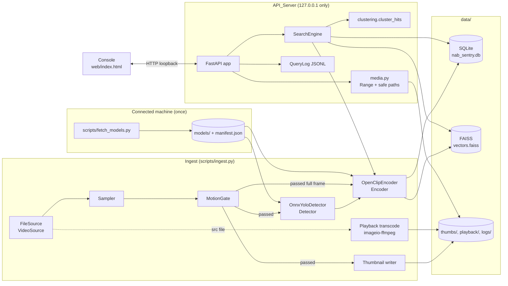
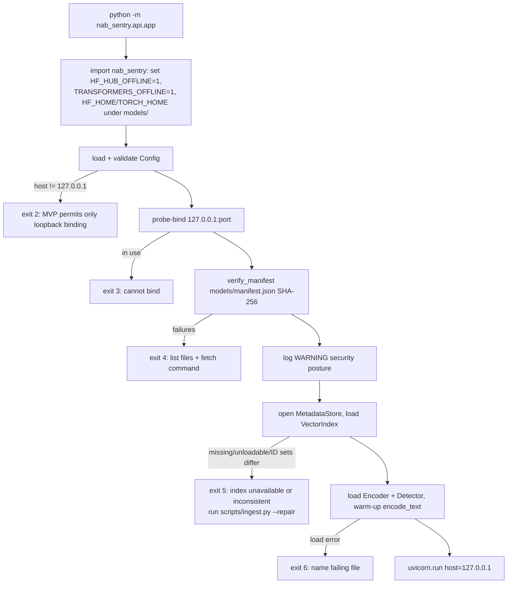

# Design Document: NAB Sentry MVP

## Overview

NAB Sentry is an offline, CPU-only natural-language search engine for surveillance footage. The MVP ingests local video files, keeps only frames with scene change, detects people and vehicles, embeds full frames and object crops with OpenCLIP, and stores metadata in SQLite and vectors in FAISS. A FastAPI service bound to 127.0.0.1 answers free-text queries with ranked, time-clustered incident clips, which a plain HTML/JS console plays back from the event start.

### Goals

- Run fully offline on the Target_Hardware (Windows, Intel Core, 16 GB RAM, no GPU, Python 3.12.10 in `venv/`).
- Keep SQLite and FAISS in a provable one-to-one state across successful ingests, failed ingests, crashes, and restarts.
- Put every non-trivial decision (metadata parsing, sampling, gating, bbox clamping, filtering, clustering, Range parsing, metrics) in pure functions so they can be property-tested with Hypothesis without loading models.
- Hide models behind protocols (`VideoSource`, `Detector`, `Encoder`) so fast tests use deterministic fakes and only `@pytest.mark.slow` tests load real weights.

### Non-goals (MVP)

RTSP ingest, tracking, VLM re-ranking, OpenVINO/INT8, authentication, tamper-evident audit log, Apache-licensed detector (YOLO11n is AGPL-3.0; accepted for the MVP).

### Delivery phasing (3-day MVP)

| Phase | Scope | Exit criterion |
|---|---|---|
| 0 | `venv` setup, pinned `requirements.txt`, `scripts/fetch_models.py` + manifest, `scripts/benchmark.py` spike | Both models load from `models/` with `HF_HUB_OFFLINE=1`; benchmark prints per-stage medians |
| 1 | `FileSource`, metadata resolution, Sampler, Motion_Gate, full-frame embeddings, SQLite + FAISS with rollback, `scripts/make_synthetic.py`, `scripts/ingest.py`, `scripts/search_cli.py` | "red square" / "blue circle" return the right synthetic intervals from the CLI |
| 2 | Detector + crop embeddings, filtered search, clustering polish, FastAPI + media Range serving | API tests pass; Range seek works in browser |
| 3 | Console, `scripts/evaluate.py` + `eval/queries.yaml`, `run_demo.ps1`, README, offline demo rehearsal | Demo runs with network adapters disabled |

`Config.enable_detector` lets Phase 1 run with frame vectors only; the pipeline, schema, and search code do not change when the detector is switched on in Phase 2.

### Research findings that shape the design

- **FAISS filtered search.** An `IDSelector` is passed through the `sel` field of `SearchParameters` (`index.search(xq, k, params=faiss.SearchParameters(sel=sel))`); `IDSelectorBatch` uses a hash set plus Bloom filter for O(1) membership ([Faiss wiki: Setting search parameters for one query](https://github.com/facebookresearch/faiss/wiki/Setting-search-parameters-for-one-query)). `IndexIDMap2` translates the selector to internal ids, so selector search works with our row-ID mapping. Because behaviour has varied across releases (see [faiss#3112](https://github.com/facebookresearch/faiss/issues/3112)), the design keeps a post-filter fallback and a model-based property test comparing the two paths (Requirement 8.4, 8.6).
- **`remove_ids` / `IndexIDMap2`.** `remove_ids` takes an `IDSelector`; `IDSelectorBatch` is built from a NumPy array ([Faiss wiki: Special operations on indexes](https://github.com/facebookresearch/faiss/wiki/Special-operations-on-indexes)). We use it for compensation and reconciliation.
- **OpenCLIP offline loading.** Loading by hub name can still try to reach Hugging Face even with offline env vars set ([open_clip#968](https://github.com/mlfoundations/open_clip/issues/968)). The Embedder therefore calls `open_clip.create_model_and_transforms("ViT-B-32", pretrained=<absolute local checkpoint path>)` and `open_clip.get_tokenizer("ViT-B-32")` (the ViT-B-32 tokenizer is the bundled BPE `SimpleTokenizer`, no download). `HF_HUB_OFFLINE=1` is still set as a second barrier.
- **YOLO11n ONNX output.** A default Ultralytics ONNX export of YOLO11n takes `(1, 3, 640, 640)` input and produces `(1, 84, 8400)`: 4 box values (cx, cy, w, h) plus 80 COCO class scores per anchor, with no NMS in the graph ([Stack Overflow: YOLOv11 output shape](https://stackoverflow.com/a/79430103)). We export with `nms=False`, `dynamic=False` and run NMS ourselves (`cv2.dnn.NMSBoxes`), which also avoids the batch>1 NMS export bug reported in [ultralytics#23647](https://github.com/ultralytics/ultralytics/issues/23647).

Content from these sources was rephrased for compliance with licensing restrictions.

## Architecture

### Component diagram



### Package layout

```
nab_sentry/
  __init__.py            # calls startup.enable_offline_mode() before anything else
  config.py              # Config dataclass, defaults, validate()
  startup.py             # offline env, manifest check, loopback check, security warning
  logging_setup.py       # console + data/logs/nab_sentry.log
  querylog.py            # QueryLog (JSON lines)
  evaluation.py          # pure relevance/metric functions used by scripts/evaluate.py
  synthetic.py           # pure frame renderer + writer used by scripts/make_synthetic.py
  ingest/
    sources.py           # VideoSource protocol, DecodedFrame, FileSource
    metadata.py          # sidecar/filename parse+format, resolve_metadata, src_hash
    sampler.py           # Sampler, sample_indices (pure)
    motion.py            # MotionGate, changed_fraction (pure)
    detector.py          # Detector protocol, Detection, OnnxYoloDetector, letterbox/postprocess/clamp_box (pure)
    transcode.py         # probe/parse, playback job, thumbnail writer
    pipeline.py          # IngestPipeline, per-video transaction + rollback, reconcile
  embed/
    clip_encoder.py      # Encoder protocol, OpenClipEncoder, batched(), l2_normalize()
  store/
    db.py                # MetadataStore, DDL, parameterised queries
    vector_index.py      # VectorIndex wrapper over IndexIDMap2(IndexFlatIP(512))
  search/
    engine.py            # SearchFilter, SearchEngine
    clustering.py        # cluster_hits (pure), label_matches (pure)
  api/
    app.py               # create_app(services), serve(cfg), `python -m nab_sentry.api.app`
    media.py             # parse_range (pure), resolve_thumb/resolve_playback, file range streaming
  web/
    index.html  app.js  styles.css
scripts/
  fetch_models.py  benchmark.py  make_synthetic.py  ingest.py  search_cli.py  evaluate.py
tests/
  conftest.py  fakes.py  strategies.py  test_*.py   # @pytest.mark.slow for real-model tests
eval/queries.yaml
run_demo.ps1
README.md
requirements.txt
```

`evaluation.py` and `synthetic.py` are small additions to the user-agreed layout so the scripts stay thin and the logic can be tested. `.gitignore` gains `models/` (data/, `*.db`, `*.onnx`, `*.pt`, `*.bin`, `*.safetensors` are already ignored).

### Runtime dependencies (pinned exactly after install in Phase 0)

| Package | Purpose | Notes |
|---|---|---|
| `torch` (CPU) | OpenCLIP runtime | `pip install torch --index-url https://download.pytorch.org/whl/cpu` |
| `open_clip_torch` | ViT-B/32 model + tokenizer | Loaded from local checkpoint only |
| `onnxruntime` | YOLO11n inference | `CPUExecutionProvider` |
| `opencv-python` | Decode, resize, motion, NMS, JPEG | One OpenCV package only (Ultralytics pulls `opencv-python`; never install `-headless` alongside) |
| `numpy` | Arrays | Version must match the faiss-cpu wheel's NumPy ABI |
| `faiss-cpu` | Vector index | Windows cp312 wheel |
| `imageio-ffmpeg` | Bundled ffmpeg (libx264) | `imageio_ffmpeg.get_ffmpeg_exe()` |
| `fastapi`, `uvicorn` | API | `uvicorn.run(app, host="127.0.0.1")` |
| `pyyaml` | `eval/queries.yaml` | |
| `huggingface_hub`, `ultralytics` | Model_Fetcher only | Never imported by runtime modules |
| `psutil` | Peak RSS sampling in `benchmark.py` | Benchmark only |
| `pytest`, `hypothesis`, `httpx` | Tests | `fastapi.testclient.TestClient` |

### Ingest flow per video

```mermaid
sequenceDiagram
    participant P as IngestPipeline
    participant M as metadata
    participant DB as MetadataStore
    participant S as FileSource+Sampler+MotionGate
    participant D as Detector
    participant E as Encoder
    participant T as Transcode job
    participant X as VectorIndex

    P->>M: src_hash(path)
    alt hash in videos table or seen this run
        P-->>P: log "already indexed", skip
    end
    P->>M: resolve_metadata(path)
    alt unresolved
        P-->>P: log "unresolved camera metadata", skip
    end
    P->>S: open (fps check, readable check)
    P->>DB: BEGIN IMMEDIATE; upsert camera; insert videos(status='ingesting')
    P->>T: start ffmpeg subprocess -> playback/v{id}.mp4.part
    loop each sampled frame
        S->>P: frame + gate decision
        alt passed
            P->>DB: insert frames row
            P->>P: write thumbs/v{id}_f{idx}.jpg
            P->>D: detect(frame)
            P->>E: enqueue full frame + crops; flush per batch_size
            E->>DB: insert vectors rows (ids from AUTOINCREMENT)
            P->>P: stage (vector_id, embedding)
        end
    end
    P->>E: flush remainder
    P->>T: wait(); rename .part -> .mp4
    P->>DB: update counts, duration, playback_path, status='complete'
    P->>X: add_with_ids(staged); save atomically (tmp + os.replace)
    P->>DB: COMMIT
    Note over P,X: any exception -> ROLLBACK, X.remove(staged) + save if added,<br/>delete written thumbs + playback files, log path + reason
```

### Search flow

```mermaid
sequenceDiagram
    participant C as Console
    participant A as API /api/search
    participant SE as SearchEngine
    participant E as Encoder
    participant DB as MetadataStore
    participant X as VectorIndex
    participant K as cluster_hits

    C->>A: GET /api/search?q=..&camera=..&start=..&end=..&cls=..&limit=..
    A->>A: validate_search_params -> 422 on error
    A->>SE: search(query, filter, limit)
    SE->>E: encode_text(q) (two prompt templates, mean, L2)
    opt filter present
        SE->>DB: allowed_vector_ids(filter)
        alt empty
            SE-->>A: []
        end
    end
    SE->>X: search(q, top_k, allowed) (IDSelectorBatch; fallback post-filter)
    SE->>DB: hit_rows(ids) (frame offset, video, camera, label, thumb, duration, start)
    SE->>K: cluster_hits(hits, videos, query, params)
    K-->>SE: events sorted by final score
    SE-->>A: events[:limit]
    A->>A: QueryLog.append(...) (failures logged, ignored)
    A-->>C: 200 JSON list
```

### Startup sequence (API_Server)



The ingest CLI runs the same steps B, C, E, F (warning not needed), then reconciliation (see Data Models) before any write.

### Key design decisions

1. **One SQLite transaction per video; FAISS add + save before COMMIT.** Every row of a video is written inside a single `BEGIN IMMEDIATE` transaction. Embeddings are staged in memory and added to FAISS only after all frames, thumbnails, and the playback file succeed. The index is saved atomically (`vectors.faiss.tmp` then `os.replace`) and only then is the DB committed. Any failure before COMMIT rolls back SQLite, removes staged IDs from FAISS (re-saving if it was already saved), and deletes the video's files. A crash between index save and COMMIT leaves orphan IDs in FAISS only; reconciliation removes them. We chose this order over commit-first because orphan index entries are removable without losing information, whereas committed rows without vectors would require deleting the video and its files.
2. **Reconcile before every ingest run.** Because a rolled-back transaction also rolls back `sqlite_sequence`, an orphan FAISS ID could be reissued. `IngestPipeline.reconcile()` runs at ingest start: it removes FAISS IDs not in `vectors`, deletes any `videos` row with `status != 'complete'` (cannot normally exist), and, if any `vectors` row lacks a FAISS vector (e.g. index file deleted), deletes those videos and their files so the next run re-ingests them. The API never reconciles; it refuses to start when the sets differ (Requirement 8.15).
3. **Epoch milliseconds for filtering.** Timestamps are stored twice: ISO 8601 with UTC offset (display, API) and integer epoch milliseconds (filtering, ordering). Naive start times are made aware in the local zone at resolution time (Requirement 1.12), so string comparison of mixed offsets never happens.
4. **Frame differencing is the default motion method.** Absolute difference against the previous valid sampled frame on a blurred grayscale downscale is deterministic, has no warm-up, and gives exactly zero change on identical frames, which is what Requirements 3.5 and 15.6 assume. MOG2 is available as `motion_method="mog2"` for real footage with lighting drift.
5. **Detections live in `vectors`.** Requirement 6.1 fixes four tables. Each kept detection always yields one crop vector (clamping guarantees ≥ 1×1 px crops), so `vectors` rows of kind `crop` are the detection records (class, confidence, bbox). Frames with zero detections have only a `frame` vector.
6. **Playback by remux when possible.** Transcoding an hour of 1080p with libx264 on a laptop CPU would dominate the 60-minute budget. If the probe shows H.264 with `yuv420p` and a browser-safe profile (Constrained Baseline, Baseline, Main, High), ffmpeg remuxes with `-c copy -movflags +faststart -an`. Otherwise it transcodes with `libx264 -preset veryfast -crf 23 -pix_fmt yuv420p -movflags +faststart -an`, scaled to at most 1280 px wide. The ffmpeg subprocess starts at the beginning of the video and runs concurrently with analysis.
7. **Models never loaded by name.** Runtime code only receives absolute file paths from `models/manifest.json`. Ultralytics and `huggingface_hub` are imported only by the Model_Fetcher.
8. **Validation in pure functions, errors in one JSON shape.** API parameter validation is a pure function returning either a `SearchRequest` or a `ParamError(param, message)`, so 422 behaviour is testable without HTTP and FastAPI's default validation format never leaks.

## Components and Interfaces

All signatures are Python 3.12 with `from __future__ import annotations`. Arrays are NumPy; images are BGR `uint8` `H×W×3`.

### config.py

```python
@dataclass(frozen=True)
class Config:
    # paths (all under the workspace)
    root: Path = Path(__file__).resolve().parents[1]
    data_dir: Path = root / "data"          # resolved in __post_init__
    models_dir: Path = root / "models"
    # derived: db_path=data/nab_sentry.db, index_path=data/vectors.faiss,
    # thumbs_dir=data/thumbs, playback_dir=data/playback, logs_dir=data/logs,
    # videos_dir=data/videos, query_log_path=data/logs/query_log.jsonl
    # server
    host: str = "127.0.0.1"
    port: int = 8765
    # sampling / gating
    sample_rate: float = 1.0            # 0.1..30
    motion_method: str = "diff"         # "diff" | "mog2"
    motion_threshold: float = 0.02      # 0.0..1.0
    motion_pixel_delta: int = 25        # 1..255, grey-level change counted as "changed"
    keyframe_interval_s: float = 10.0   # 1..600
    gate_width: int = 320               # 64..1920
    # detection
    enable_detector: bool = True
    det_conf: float = 0.35              # 0.0..1.0
    det_iou: float = 0.45               # 0.0..1.0
    det_max_per_frame: int = 10         # 1..100
    det_input_size: int = 640
    # embedding
    batch_size: int = 8                 # 1..64
    num_threads: int = 0                # 0 = physical cores
    # search
    top_k: int = 300                    # 1..10000
    force_postfilter: bool = False      # test/diagnostic hook: skip IDSelectorBatch path
    merge_gap_s: float = 8.0            # >= 0
    event_padding_s: float = 3.0        # >= 0
    label_boost: float = 0.02           # >= 0
    default_limit: int = 20
    max_limit: int = 100
    max_query_len: int = 256
    # media
    thumb_width: int = 320
    playback_max_width: int = 1280

    def validate(self) -> list[ConfigIssue]: ...   # one issue per out-of-range/non-numeric/missing field
    def require_valid(self) -> None: ...           # raises ConfigError(issues) naming each parameter

def load_config(overrides: Mapping[str, str] | None = None) -> Config: ...
```

Every tunable listed in Requirement 16.5 is defined once here; scripts accept `--set name=value` overrides that go through `load_config`, so the Evaluator report can dump `dataclasses.asdict(cfg)`. `require_valid()` is called at the start of ingest (Requirements 2.8, 3.8), by the Detector constructor (4.9), and at API startup.

### startup.py

```python
def enable_offline_mode() -> None
    # sets HF_HUB_OFFLINE=1, TRANSFORMERS_OFFLINE=1, HF_DATASETS_OFFLINE=1,
    # HF_HOME=models/.hf, TORCH_HOME=models/.torch; called from nab_sentry/__init__.py
def verify_manifest(models_dir: Path) -> ManifestResult
    # ManifestResult(files: dict[str, Path], failures: list[ManifestFailure(path, reason)])
    # reasons: "manifest missing" | "manifest unreadable" | "file missing" | "sha256 mismatch"
def require_models(models_dir: Path) -> dict[str, Path]   # exits non-zero with FETCH_HINT on failure
def ensure_loopback(host: str) -> None                    # raises StartupError unless host == "127.0.0.1"
def log_security_warning(logger) -> None
FETCH_HINT = r"venv\Scripts\python.exe scripts\fetch_models.py  (run on a connected machine, then copy models\)"
```

Hashing uses `hashlib.sha256` over 1 MiB chunks; the ~600 MB CLIP checkpoint plus 11 MB ONNX file hash in a few seconds, inside the 30 s budget (Requirement 13.4).

### ingest/sources.py

```python
@dataclass(frozen=True)
class DecodedFrame:
    index: int          # zero-based decode index (counts failed frames too)
    offset_s: float     # index / fps
    image: np.ndarray   # may be empty (size 0) -> MotionGate discards it

class VideoSource(Protocol):
    path: Path
    fps: float
    width: int
    height: int
    est_frame_count: int            # container estimate, used only for progress + initial duration
    def frames(self) -> Iterator[DecodedFrame]: ...
    @property
    def decoded_index_count(self) -> int: ...   # frames advanced so far (after iteration: total)
    @property
    def failed_frames(self) -> int: ...
    def close(self) -> None: ...

class FileSource:   # implements VideoSource
    @classmethod
    def open(cls, path: Path) -> FileSource
        # cv2.VideoCapture(str(path), cv2.CAP_FFMPEG)
        # raises UnreadableVideo if not opened; UnknownFrameRate if CAP_PROP_FPS <= 0 or NaN
```

`frames()` loops `grab()` until it returns False; for each grabbed index it calls `retrieve()`. A failed `retrieve()` is logged with path and offset and not yielded (Requirement 2.7). Offsets are `index / fps`, so the first offset is exactly 0.0 and offsets are non-decreasing (1.1). If iteration ends with zero yielded frames, the pipeline raises `UnreadableVideo` (1.11, 2.10). Actual duration is `decoded_index_count / fps`, written to `videos.duration_s` when the video completes.

### ingest/metadata.py

```python
CAMERA_ID_RE = re.compile(r"[A-Za-z0-9-]{1,64}")
FILENAME_RE  = re.compile(r"^(?P<cam>[A-Za-z0-9-]{1,64})_(?P<ts>\d{8}T\d{6})\.(?P<ext>[A-Za-z0-9]{1,10})$")

@dataclass(frozen=True)
class Sidecar:
    camera_id: str
    label: str
    start_time: datetime        # aware or naive, as written

@dataclass(frozen=True)
class SidecarParse:
    sidecar: Sidecar | None
    errors: list[str]           # field names, or ["unparseable"], or ["missing"]

@dataclass(frozen=True)
class ResolvedMetadata:
    camera_id: str
    label: str
    start_time: datetime        # always aware (naive -> local zone)
    source: Literal["sidecar", "filename"]

def format_filename(camera_id: str, start: datetime, ext: str) -> str     # zero-padded manual formatting, years 0001..9999
def parse_filename(name: str) -> tuple[str, datetime] | None              # naive datetime; None if no match or invalid calendar value
def serialize_sidecar(s: Sidecar) -> str                                   # json.dumps({camera_id, label, start_time: isoformat()})
def parse_sidecar_text(text: str) -> SidecarParse                         # pure
def resolve_metadata(video_path: Path, log) -> ResolvedMetadata | None    # sidecar first, then filename, else None
def to_aware_local(dt: datetime) -> datetime                               # naive -> dt.astimezone() (local zone); aware unchanged
def src_hash(path: Path, chunk: int = 1 << 20) -> str                      # SHA-256 hex of file bytes
```

Sidecar validation: top-level JSON object; `camera_id` str matching `CAMERA_ID_RE` (full match); `label` str of 1–128 chars with `label.strip() != ""`; `start_time` str accepted by `datetime.fromisoformat` and containing a time part (`"T"` or space separator). Every invalid field name is collected and logged (1.6). `format_filename` uses `f"{y:04d}{m:02d}{d:02d}T{H:02d}{M:02d}{S:02d}"` rather than `strftime`, which is unreliable for years below 1000 on Windows.

### ingest/sampler.py

```python
def sample_indices(n_frames: int, fps: float, rate: float,
                   decodable: Callable[[int], bool] = lambda i: True) -> list[int]   # pure reference
class Sampler:
    def __init__(self, rate: float): ...
    def select(self, frames: Iterable[DecodedFrame]) -> Iterator[DecodedFrame]: ...
```

Algorithm (shared by both): keep `k = 0`. For each yielded frame in order, if `frame.offset_s >= k / rate - EPS` (EPS = 1e-9), select it and set `k += 1`. A frame is selected at most once, so target k picks the first not-yet-selected frame at or after `k / rate` (2.1). When `fps < rate`, every frame satisfies its target and is selected exactly once (2.6). For a fully decodable video of duration D = n/fps with `fps >= rate`, targets `k = 0..floor(D·rate)` exist and the last may fall after the final frame, giving `floor(D·r)` or `floor(D·r)+1` selections (2.5).

### ingest/motion.py

```python
@dataclass(frozen=True)
class GateDecision:
    passed: bool
    reason: Literal["first", "motion", "keyframe", "static", "empty"]
    fraction: float                     # 0.0..1.0; 0.0 for "first"/"empty"

def downscale_gray(image: np.ndarray, gate_width: int) -> np.ndarray   # cv2 INTER_AREA; no upscale; aspect kept; GaussianBlur 5x5
def changed_fraction(prev: np.ndarray, cur: np.ndarray, pixel_delta: int) -> float   # mean(absdiff > delta)

class MotionGate:
    def __init__(self, threshold: float, keyframe_interval_s: float, gate_width: int,
                 pixel_delta: int, method: Literal["diff", "mog2"] = "diff"): ...
    def reset(self) -> None: ...                       # called at the start of every video (3.4)
    def evaluate(self, frame: DecodedFrame) -> GateDecision: ...
```

`evaluate` logic, in order:
1. Empty or zero-size image → `empty`, not passed, state untouched (3.9).
2. No valid frame seen yet in this video → `first`, passed (3.4).
3. `offset - last_passed_offset >= keyframe_interval_s - EPS` → `keyframe`, passed (3.3, video time only).
4. Compute fraction against the previous valid sampled frame (diff) or the MOG2 model; `>= threshold` → `motion`, passed (3.2).
5. Otherwise `static`, discarded (3.7).

The previous-frame reference is updated on every valid frame; `last_passed_offset` only on passes. The pipeline counts `sampled_count` (all selected frames, including empty ones) and `passed_count`.

### ingest/detector.py

```python
TARGET_CLASSES: dict[int, str] = {0: "person", 1: "bicycle", 2: "car", 3: "motorcycle", 5: "bus", 7: "truck"}

@dataclass(frozen=True)
class Detection:
    cls: str
    conf: float
    box: tuple[int, int, int, int]      # x1, y1, x2, y2 in source-frame pixels

class Detector(Protocol):
    def detect(self, frame: np.ndarray) -> list[Detection]: ...

@dataclass(frozen=True)
class LetterboxMeta:
    scale: float
    pad_x: float
    pad_y: float

def letterbox(frame: np.ndarray, size: int) -> tuple[np.ndarray, LetterboxMeta]   # RGB, /255, CHW, (1,3,size,size) float32, pad 114
def clamp_box(x1: float, y1: float, x2: float, y2: float, w: int, h: int) -> tuple[int, int, int, int] | None
    # floor x1/y1, ceil x2/y2, clamp to [0,w]/[0,h]; None if x2-x1 < 1 or y2-y1 < 1
def postprocess(raw: np.ndarray, meta: LetterboxMeta, frame_w: int, frame_h: int,
                conf: float, iou: float, max_det: int) -> list[Detection]
    # raw (1,84,8400): transpose; best class per anchor; keep TARGET_CLASSES with score >= conf;
    # undo letterbox; class-wise NMS (cv2.dnn.NMSBoxes); clamp_box; sort by conf desc (tie: x1,y1); take max_det

class OnnxYoloDetector:   # implements Detector
    def __init__(self, model_path: Path, conf: float, iou: float, max_det: int,
                 input_size: int = 640, threads: int = 0): ...
        # validates conf/iou in [0,1], max_det in [1,100] -> ConfigError (4.9)
        # missing file -> ModelMissingError(path, FETCH_HINT) (4.6)
        # ort.InferenceSession(path, providers=["CPUExecutionProvider"], sess_options with intra_op threads)
```

### embed/clip_encoder.py

```python
PROMPT_TEMPLATES: tuple[str, str] = ("{q}", "a CCTV photo of {q}")
EMBED_DIM = 512

class Encoder(Protocol):
    dim: int
    batch_size: int
    def encode_images(self, images: Sequence[np.ndarray]) -> np.ndarray: ...   # (n, 512) float32, unit rows
    def encode_text(self, query: str) -> np.ndarray: ...                        # (512,) float32, unit

def batched(items: Sequence[T], n: int) -> Iterator[Sequence[T]]: ...           # all full except last (1..n)
def l2_normalize(x: np.ndarray, axis: int = -1) -> np.ndarray: ...             # raises EmbeddingError on zero/non-finite

class OpenClipEncoder:   # implements Encoder
    def __init__(self, weights_path: Path, batch_size: int = 8, threads: int = 0): ...
        # missing/unreadable weights -> ModelMissingError (5.8), never downloads
        # open_clip.create_model_and_transforms("ViT-B-32", pretrained=str(weights_path))
        # tokenizer = open_clip.get_tokenizer("ViT-B-32"); model.eval(); torch.set_num_threads(...)
    def encode_images(...)   # BGR->RGB PIL, preprocess, torch.inference_mode, batched(batch_size)
    def encode_text(self, query)
        # q = query.strip(); empty -> EmptyQueryError (5.9)
        # tokens = tokenizer([t.format(q=q) for t in PROMPT_TEMPLATES])  # context 77, truncates
        # v = l2_normalize(mean(l2_normalize(model.encode_text(tokens)), axis=0))
```

Each per-template vector is normalised before averaging (standard CLIP prompt ensembling); the mean is then normalised (5.4). Outputs are checked with `np.isfinite`; a non-finite result raises `EmbeddingError` rather than being stored (5.3).

### ingest/transcode.py

```python
@dataclass(frozen=True)
class ProbeInfo:
    codec: str | None
    profile: str | None
    pix_fmt: str | None
    duration_s: float | None

def parse_ffmpeg_probe(stderr: str) -> ProbeInfo                 # pure: parses "Duration: hh:mm:ss.xx" and "Video: h264 (High), yuv420p..."
def probe_video(path: Path) -> ProbeInfo                          # runs `ffmpeg -hide_banner -i path`
def playback_command(src: Path, dst: Path, probe: ProbeInfo, max_width: int) -> list[str]   # pure: remux or transcode argv
class PlaybackJob:
    def __init__(self, argv: list[str]): ...                      # subprocess.Popen, stderr to temp log
    def wait(self) -> None: ...                                   # non-zero exit -> TranscodeError(stderr tail)
    def kill(self) -> None: ...
def write_thumbnail(image: np.ndarray, path: Path, width: int = 320) -> None
    # height = round(width * h / w); cv2.imencode(".jpg", q=85) -> write to path (raises ThumbnailError)
```

Argv is always a list (no shell), so file names with spaces or metacharacters are safe. The output is written to `v{video_id}.mp4.part` and renamed to `v{video_id}.mp4` after a successful exit.

### ingest/pipeline.py

```python
@dataclass(frozen=True)
class VideoResult:
    path: Path
    status: Literal["ingested", "already_indexed", "unresolved_metadata", "unreadable", "failed"]
    video_id: int | None = None
    reason: str | None = None
    sampled: int = 0
    passed: int = 0
    vectors: int = 0

@dataclass(frozen=True)
class IngestReport:
    results: list[VideoResult]
    @property
    def ingested(self) -> int: ...
    @property
    def failed(self) -> int: ...       # unresolved + unreadable + failed

class IngestPipeline:
    def __init__(self, cfg: Config, db: MetadataStore, index: VectorIndex,
                 encoder: Encoder, detector: Detector | None,
                 open_source: Callable[[Path], VideoSource] = FileSource.open,
                 start_playback: Callable[[Path, Path], PlaybackJob] = default_playback): ...
    def reconcile(self) -> ReconcileReport: ...
    def ingest_paths(self, paths: Iterable[Path]) -> IngestReport: ...   # sorted, de-duplicated by hash within the run
    def ingest_video(self, path: Path) -> VideoResult: ...
```

`ingest_video` steps (each numbered step maps to the sequence diagram):

1. `h = src_hash(path)`; on `OSError` → log, `failed` (7.8). If `h` in DB or in `self._seen_hashes` → log `"already indexed: <path>"`, `already_indexed` (7.3).
2. `resolve_metadata` → `None` → `unresolved_metadata` (1.5).
3. `open_source(path)` → `UnreadableVideo` / `UnknownFrameRate` → `unreadable` (1.11, 2.9, 2.10).
4. `with db.transaction():` upsert camera (1.9, 1.10), insert `videos` row with `status='ingesting'` (6.9), start playback job.
5. For each sampled frame: gate; if passed insert `frames`, write thumbnail, detect (errors → warning, zero detections, 4.8), enqueue the frame image and each crop `frame[y1:y2, x1:x2]` into the embedding queue; flush full batches; each flushed item inserts its `vectors` row and stages `(vector_id, embedding)`.
6. Flush the remainder; if `passed_count == 0` raise `UnreadableVideo`.
7. Wait for the playback job; rename `.part`; update the `videos` row (counts, actual duration, `playback_path`, `status='complete'`).
8. `index.add(staged_ids, staged_vecs)`; `index.save(cfg.index_path)`.
9. COMMIT (leaving the `with` block).

Any exception in steps 4–9 runs `_rollback(video_id, staged_ids, written_files, index_touched)`: SQLite ROLLBACK (automatic when the `with` exits by exception), `index.remove(staged_ids)` and re-save if step 8 ran, kill the playback job, delete written thumbnails and `.part`/`.mp4` files, and log `"ingest failed: <path>: <reason>"` (6.8, 7.7). Other videos are untouched because only files and IDs recorded for this video are removed.

### store/db.py

```python
class MetadataStore:
    def __init__(self, path: Path): ...          # sqlite3.connect(path, isolation_level=None, check_same_thread=False)
                                                 # PRAGMA foreign_keys=ON; journal_mode=WAL; busy_timeout=5000
    def init_schema(self) -> None: ...
    @contextmanager
    def transaction(self) -> Iterator[None]: ... # BEGIN IMMEDIATE / COMMIT / ROLLBACK
    def upsert_camera(self, camera_id: str, label: str) -> Literal["created", "exists", "label_conflict"]
    def hash_exists(self, src_hash: str) -> bool
    def insert_video(self, v: NewVideo) -> int
    def insert_frame(self, f: NewFrame) -> int
    def insert_vector(self, v: NewVector) -> int
    def finalize_video(self, video_id: int, *, sampled: int, passed: int, duration_s: float, playback_path: str) -> None
    def delete_video(self, video_id: int) -> list[str]           # returns file paths to delete; cascades
    def vector_ids(self) -> np.ndarray                            # int64, sorted
    def allowed_vector_ids(self, f: SearchFilter) -> np.ndarray   # int64
    def hit_rows(self, ids: Sequence[int]) -> dict[int, HitRow]
    def cameras(self) -> list[tuple[str, str]]
    def counts(self) -> Counts                                    # cameras, videos(complete), frames, vectors
    def playback_for(self, video_id: int) -> str | None
```

Every statement uses `?` placeholders; no request value is ever formatted into SQL (18.4). `hit_rows` and `allowed_vector_ids` pass ID lists through a temporary table (`CREATE TEMP TABLE ids(id INTEGER PRIMARY KEY)` + `executemany`) to avoid SQLite's variable-count limit. The API uses one connection guarded by a `threading.Lock`; ingest is a separate process using WAL so the API can read while ingest writes.

`allowed_vector_ids` builds a fixed SQL template with optional clauses chosen by which filter parts are set (the clause text is constant; only bound values vary):

```sql
SELECT v.vector_id FROM vectors v
JOIN frames f ON f.frame_id = v.frame_id
JOIN videos d ON d.video_id = f.video_id
WHERE d.status = 'complete'
  AND (:camera IS NULL OR d.camera_id = :camera)
  AND (:start_ms IS NULL OR f.abs_epoch_ms >= :start_ms)
  AND (:end_ms IS NULL OR f.abs_epoch_ms <= :end_ms)
  AND (:cls IS NULL OR (v.kind = 'crop' AND v.det_class = :cls))
ORDER BY v.vector_id
```

### store/vector_index.py

```python
@dataclass(frozen=True)
class Hit:
    vector_id: int
    similarity: float

class VectorIndex:
    def __init__(self, dim: int = 512): ...        # faiss.IndexIDMap2(faiss.IndexFlatIP(dim))
    @classmethod
    def load(cls, path: Path) -> VectorIndex: ...  # faiss.read_index; checks type, dim -> IndexUnavailable
    def save(self, path: Path) -> None: ...        # write_index(tmp in same dir); fsync; os.replace(tmp, path)
    @property
    def ntotal(self) -> int: ...
    def ids(self) -> np.ndarray: ...               # faiss.vector_to_array(index.id_map), int64
    def add(self, ids: np.ndarray, vecs: np.ndarray) -> None: ...   # add_with_ids; rejects duplicates / bad shape
    def remove(self, ids: np.ndarray) -> int: ...  # remove_ids(IDSelectorBatch)
    def search(self, q: np.ndarray, k: int, allowed: np.ndarray | None = None) -> list[Hit]: ...
    def search_restricted(self, q, k, allowed) -> list[Hit]: ...    # SearchParameters(sel=IDSelectorBatch(allowed))
    def search_postfilter(self, q, k, allowed, fallback_k: int) -> list[Hit]: ...
```

`search` with `allowed is None` runs a plain search with `k = min(k, ntotal)`. With `allowed`, it calls `search_restricted` with `k = min(k, len(allowed))`; any exception (or `Config.force_postfilter` in tests) falls back to `search_postfilter` with `fallback_k = min(ntotal, 10 * top_k)`, dropping IDs not in `allowed` (8.4). Padding IDs `-1` are always dropped. Results are sorted by `(-similarity, vector_id)` so ties order deterministically.

### search/clustering.py

```python
@dataclass(frozen=True)
class ClusterHit:
    vector_id: int
    camera_id: str
    video_id: int
    frame_offset_s: float
    similarity: float
    thumb_path: str

@dataclass(frozen=True)
class VideoInfo:
    duration_s: float
    start_epoch_ms: int
    start_time: datetime        # aware
    camera_label: str

@dataclass(frozen=True)
class ClusterParams:
    merge_gap_s: float
    padding_s: float
    label_boost: float

@dataclass(frozen=True)
class Event:
    camera_id: str
    video_id: int
    hits: tuple[ClusterHit, ...]    # sorted by (offset, vector_id)
    start_s: float
    end_s: float
    score: float                    # Event_Score after Label_Boost
    relative_score: float
    thumb_path: str

def query_words(text: str) -> set[str]       # lowercase, split on non-alphanumerics, len >= 3
def label_words(label: str) -> set[str]      # lowercase, split on non-alphanumerics
def event_score(sims: Sequence[float]) -> float   # mean of top-3 (or all if < 3)
def cluster_hits(hits: Sequence[ClusterHit], videos: Mapping[int, VideoInfo],
                 query: str, params: ClusterParams) -> list[Event]
```

Algorithm:

1. If `hits` is empty return `[]` (9.15).
2. `median = statistics.median(h.similarity for h in hits)`.
3. Group by `(camera_id, video_id)`; sort each group by `(frame_offset_s, vector_id)` (9.1). Sorting by a total key makes the output independent of input order (9.13).
4. Walk each group: start a new Event when `cur.offset - prev.offset > merge_gap_s + EPS`, otherwise append (gap exactly equal merges, 9.2, 9.3).
5. For each Event: `start = max(0, first.offset - padding)`, `end = min(duration, last.offset + padding)` (9.7); `score = event_score(sorted sims desc)`; `+ label_boost` once if `query_words(query) & label_words(label)` (9.10, 9.11); `relative = score - median` (9.9); thumbnail from the hit with max similarity, ties by earliest offset then lowest vector_id (9.14).
6. Sort by `(-score, start_epoch_ms + start*1000, camera_id, video_id, start_s)` (9.12).

`EPS = 1e-9` is a module constant shared with the property tests. Hit offsets never exceed duration because `duration_s = decoded_count / fps` and every offset is `index / fps` with `index < decoded_count`.

### search/engine.py

```python
@dataclass(frozen=True)
class SearchFilter:
    camera_id: str | None = None
    start: datetime | None = None   # aware
    end: datetime | None = None     # aware
    cls: str | None = None
    def is_empty(self) -> bool: ...

def validate_filter(f: SearchFilter) -> None   # FilterError(part, message): start > end -> "time_range"; bad cls -> "cls"

class SearchEngine:
    def __init__(self, cfg: Config, db: MetadataStore, index: VectorIndex, encoder: Encoder | None): ...
    def check_ready(self) -> None    # SearchUnavailable if encoder None, or index IDs != db vector IDs (8.15)
    def search_vector(self, qvec: np.ndarray, f: SearchFilter, query_text: str) -> list[Event]
    def search(self, query: str, f: SearchFilter, limit: int) -> list[Event]
```

`search` order: `validate_filter` → `encoder.encode_text` → if filter non-empty compute allowed set, return `[]` if empty without touching the index (8.12) → `index.search` → `db.hit_rows` → `cluster_hits` → `[:limit]`. A camera missing from `cameras` simply produces an empty allowed set (8.13). The readiness check compares ID sets once at startup and after nothing else (the API does not see ingests that run while it is up; restart picks them up).

### api/media.py

```python
@dataclass(frozen=True)
class FullBody: ...
@dataclass(frozen=True)
class PartialBody:
    start: int
    end: int          # inclusive
@dataclass(frozen=True)
class Unsatisfiable: ...

RangeResult = FullBody | PartialBody | Unsatisfiable
RANGE_RE = re.compile(r"^bytes=(\d*)-(\d*)$")

def parse_range(header: str | None, size: int) -> RangeResult
def resolve_thumb(thumbs_dir: Path, name: str) -> Path | None
def resolve_playback(playback_dir: Path, stored_name: str | None) -> Path | None
def iter_file(path: Path, start: int, end: int, chunk: int = 256 * 1024) -> Iterator[bytes]
```

`parse_range` rules (size ≥ 1):

| Header | Result |
|---|---|
| `None`, not matching `RANGE_RE`, contains `,`, `bytes=-`, or `a > b` | `FullBody` (11.10) |
| `bytes=a-b`, `a < size` | `PartialBody(a, min(b, size-1))` (11.2) |
| `bytes=a-`, `a < size` | `PartialBody(a, size-1)` (11.3) |
| `bytes=-n`, `n > 0` | `PartialBody(max(0, size-n), size-1)` (11.9) |
| `bytes=a-b` or `bytes=a-` with `a >= size`; `bytes=-0` | `Unsatisfiable` (11.5) |

For a 0-byte file every range is `Unsatisfiable`; a missing Range still returns `FullBody` with `Content-Length: 0`.

`resolve_thumb` accepts only names matching `^[A-Za-z0-9_-]{1,128}\.jpg$` (this already rejects `..`, separators, drive letters, and encoded separators after Starlette's URL decoding), then checks `(thumbs_dir / name).resolve()` has `thumbs_dir.resolve()` as its parent and is a regular file. `resolve_playback` takes the name stored in `videos.playback_path`, applies the same pattern (`^v\d+\.mp4$`) and containment check. Anything else returns `None` → 404 with no file bytes (11.6, 11.8, 18.6).

### api/app.py

```python
@dataclass
class Services:
    cfg: Config
    db: MetadataStore
    index: VectorIndex | None
    encoder: Encoder | None
    detector_loaded: bool
    engine: SearchEngine | None
    query_log: QueryLog

def validate_search_params(params: Mapping[str, str], cfg: Config) -> SearchRequest | ParamError   # pure
def create_app(services: Services) -> FastAPI
def serve(cfg: Config) -> NoReturn     # startup sequence, then uvicorn.run(app, host="127.0.0.1", port=cfg.port)
```

Endpoints are listed under Data Models (API contracts). Exception handlers: `ParamError`/`RequestValidationError` → 422; `SearchUnavailable` → 503; any other `Exception` → 500 `{"error": {"code": "internal_error", "message": "Internal server error"}}`, with the traceback written only to the server log (18.7). Static files: `/` returns `web/index.html`; `/static/{app.js,styles.css}` are served by `StaticFiles(directory=web)`.

### querylog.py

```python
class QueryLog:
    def __init__(self, path: Path): ...
    def append(self, record: QueryRecord) -> bool: ...   # open("a", encoding="utf-8"), one json.dumps line, flush; lock;
                                                        # OSError -> logged warning, returns False (10.14)
```

### web/ (Console)

Single `index.html` loading `/static/app.js` and `/static/styles.css`; no CDN, fonts, or remote images; system font stack; a CSP meta tag `default-src 'self'; media-src 'self'; img-src 'self'` enforces 13.10 and 12.1.

Layout: search form (`<form role="search">` with labelled `<input id="q" maxlength="256">`, camera `<select>`, two `<input type="datetime-local">`, class `<select>` with "All classes" + six Target_Classes, submit button) → status region (`<div role="status" aria-live="polite">`) → results list (`<ol>` of `<li><button class="card">` with thumbnail ``, label, times, score) → player panel (`<video controls preload="metadata">`, timeline overlay `<div class="span">`, Replay/Previous/Next buttons).

Behaviour (`app.js`, plain ES2020 modules, no framework):
- `fetchWithTimeout(url, 30000)` via `AbortController` for both `/api/cameras` and `/api/search` (12.6, 12.14).
- `buildSearchUrl(form)` trims `q` and adds only set filters (12.3); client-side 1–256 validation runs before any request (12.13).
- `formatTs(iso)` returns `iso.slice(0,10) + " " + iso.slice(11,19)` so the displayed wall-clock time is the camera-local time in the ISO string, not the browser's zone (12.4).
- Activating a card sets `video.src = video_url`, waits for `loadedmetadata`, sets `currentTime = start_offset_s`, positions the span at `left = start/duration`, `width = (end-start)/duration`, and sets `aria-current="true"` on exactly one card (12.7, 12.8). `error` on the video shows a message in the player area and leaves the list and active card unchanged (12.15).
- Buttons are native `<button>` elements, so Tab order follows DOM order and Enter/Space work (12.11); `:focus-visible { outline: 3px solid #1a73e8; outline-offset: 2px; }`.

### Scripts

| Script | Behaviour |
|---|---|
| `fetch_models.py` | Deletes any existing `models/manifest.json` first. Downloads `open_clip_pytorch_model.bin` from `laion/CLIP-ViT-B-32-laion2B-s34B-b79K` via `huggingface_hub.hf_hub_download(local_dir=models/open_clip/ViT-B-32-laion2b_s34b_b79k)` and `yolo11n.pt` via Ultralytics, each with up to 3 attempts and exponential backoff. Exports ONNX (`format="onnx", imgsz=640, dynamic=False, nms=False`) to `models/yolo11n.onnx`. Smoke-loads both with the runtime loaders, writes `manifest.json.tmp` and renames it to `manifest.json`. Any failure: message naming the file, exit 1, no manifest (13.1, 13.2, 13.8). |
| `ingest.py [paths...] [--repair] [--set k=v]` | Default path `data/videos/`. Runs startup checks, `reconcile()`, then `ingest_paths`. Prints `ingested=N failed=M already_indexed=K vectors=V`. Exit 1 if no video files found or the index has zero vectors afterwards (17.7). `--repair` runs only `reconcile()`. |
| `search_cli.py "query" [--camera ..] [--start ..] [--end ..] [--cls ..] [--limit ..]` | In-process `SearchEngine`, prints a table. Phase 1 demo tool. |
| `make_synthetic.py [--out data/videos] [--seed 0] [--duration 90] [--fps 10] ...` | Validates settings, renders into a temp dir inside the output dir, writes MP4 + sidecar + `ground_truth.json`, renames all three; on any failure deletes the temp dir (15.8, 15.9). |
| `benchmark.py VIDEO [--iters 50]` | 5 warm-up + ≥ 50 timed iterations per stage; prints median/p95 for decode, motion gate fps, detector ms/frame, embedder ms/image at batch 1 and 8; projects ingest minutes per footage hour. `--search N` builds a random N-vector index and times filtered/unfiltered searches. Failed stages are reported and the exit code is 1 (14.1, 14.2, 14.8). |
| `evaluate.py [--queries eval/queries.yaml]` | See evaluation in Data Models. |

Projection formula (14.2), per hour of footage with source fps `F`, sample rate `r`, pass fraction `p`, mean kept detections per passed frame `c`:

```
minutes = (3600·F·t_decode + 3600·r·t_gate + 3600·r·p·(t_det + t_thumb + (1 + c)·t_embed@8)) / 60
```

`t_*` are measured medians; transcode runs concurrently and is reported separately.

### run_demo.ps1

1. `$py = "venv\Scripts\python.exe"`; if missing → `Write-Error "venv/ not found: create it with py -3.12 -m venv venv and pip install -r requirements.txt"`; `exit 1`. Dot-source `venv\Scripts\Activate.ps1` when execution policy allows; all calls use `$py` directly either way.
2. If `data\nab_sentry.db` or `data\vectors.faiss` is missing → `& $py scripts\ingest.py data\videos`; non-zero exit → print the reported error, `exit 1` (17.2, 17.7).
3. `Start-Process $py -ArgumentList "-m","nab_sentry.api.app" -PassThru -NoNewWindow`.
4. Poll `Invoke-RestMethod http://127.0.0.1:$port/api/health` every 500 ms for up to 30 s from script start; if the server process exits first, print its error (manifest, bind, index) and `exit` with its code (17.6).
5. When `models_loaded.detector -and models_loaded.embedder`, print `NAB Sentry console: http://127.0.0.1:<port>/` (17.1).

## Data Models

### SQLite schema (DDL)

```sql
PRAGMA foreign_keys = ON;
PRAGMA journal_mode = WAL;

CREATE TABLE IF NOT EXISTS schema_meta (
    key   TEXT PRIMARY KEY,
    value TEXT NOT NULL
);  -- ('schema_version', '1'), ('embed_model', 'ViT-B-32/laion2b_s34b_b79k'), ('dim', '512')

CREATE TABLE IF NOT EXISTS cameras (
    camera_id  TEXT PRIMARY KEY CHECK (length(camera_id) BETWEEN 1 AND 64),
    label      TEXT NOT NULL CHECK (length(label) BETWEEN 1 AND 128),
    created_at TEXT NOT NULL
);

CREATE TABLE IF NOT EXISTS videos (
    video_id       INTEGER PRIMARY KEY AUTOINCREMENT,
    camera_id      TEXT    NOT NULL REFERENCES cameras(camera_id),
    src_path       TEXT    NOT NULL,
    src_hash       TEXT    NOT NULL UNIQUE,          -- SHA-256 hex
    start_ts       TEXT    NOT NULL,                 -- ISO 8601 with UTC offset
    start_epoch_ms INTEGER NOT NULL,
    fps            REAL    NOT NULL CHECK (fps > 0),
    width          INTEGER NOT NULL,
    height         INTEGER NOT NULL,
    duration_s     REAL    NOT NULL CHECK (duration_s >= 0),
    sampled_count  INTEGER NOT NULL DEFAULT 0,
    passed_count   INTEGER NOT NULL DEFAULT 0 CHECK (passed_count <= sampled_count),
    playback_path  TEXT,                             -- file name under data/playback/
    status         TEXT    NOT NULL CHECK (status IN ('ingesting', 'complete')),
    ingested_at    TEXT    NOT NULL
);

CREATE TABLE IF NOT EXISTS frames (
    frame_id     INTEGER PRIMARY KEY AUTOINCREMENT,
    video_id     INTEGER NOT NULL REFERENCES videos(video_id) ON DELETE CASCADE,
    frame_idx    INTEGER NOT NULL CHECK (frame_idx >= 0),
    offset_s     REAL    NOT NULL CHECK (offset_s >= 0),
    abs_ts       TEXT    NOT NULL,                   -- ISO 8601, millisecond precision, with offset
    abs_epoch_ms INTEGER NOT NULL,
    gate_reason  TEXT    NOT NULL CHECK (gate_reason IN ('first', 'motion', 'keyframe')),
    motion_frac  REAL    NOT NULL CHECK (motion_frac BETWEEN 0 AND 1),
    thumb_path   TEXT    NOT NULL,                   -- file name under data/thumbs/
    UNIQUE (video_id, frame_idx)
);
CREATE INDEX IF NOT EXISTS idx_frames_video_offset ON frames(video_id, offset_s);
CREATE INDEX IF NOT EXISTS idx_frames_epoch        ON frames(abs_epoch_ms);

CREATE TABLE IF NOT EXISTS vectors (
    vector_id INTEGER PRIMARY KEY AUTOINCREMENT,     -- == FAISS id
    frame_id  INTEGER NOT NULL REFERENCES frames(frame_id) ON DELETE CASCADE,
    kind      TEXT    NOT NULL CHECK (kind IN ('frame', 'crop')),
    det_class TEXT    CHECK (det_class IN ('person','car','truck','bus','motorcycle','bicycle')),
    det_conf  REAL    CHECK (det_conf BETWEEN 0 AND 1),
    x1 INTEGER, y1 INTEGER, x2 INTEGER, y2 INTEGER,
    CHECK (
        (kind = 'frame' AND det_class IS NULL AND det_conf IS NULL
            AND x1 IS NULL AND y1 IS NULL AND x2 IS NULL AND y2 IS NULL)
     OR (kind = 'crop' AND det_class IS NOT NULL AND det_conf IS NOT NULL
            AND x1 >= 0 AND y1 >= 0 AND x1 < x2 AND y1 < y2)
    )
);
CREATE INDEX IF NOT EXISTS idx_vectors_frame      ON vectors(frame_id);
CREATE INDEX IF NOT EXISTS idx_vectors_kind_class ON vectors(kind, det_class);
```

Notes:
- `x2 <= width`, `y2 <= height` are enforced by `clamp_box` and checked by a property test (SQLite CHECK cannot reference the parent row).
- `AUTOINCREMENT` prevents ID reuse after committed deletes; reconciliation handles the rolled-back case (Key decision 2).
- `ON DELETE CASCADE` lets `delete_video` remove frames and vectors in one statement during reconciliation.
- `thumb_path` is `v{video_id}_f{frame_idx:07d}.jpg`, unique per `frames` row by the `UNIQUE (video_id, frame_idx)` constraint (6.4).

### In-memory domain types

| Type | Fields |
|---|---|
| `NewVideo` | camera_id, src_path, src_hash, start_ts (aware), fps, width, height, est_duration_s |
| `NewFrame` | video_id, frame_idx, offset_s, abs_time (aware), gate_reason, motion_frac, thumb_path |
| `NewVector` | frame_id, kind, det_class?, det_conf?, box? |
| `HitRow` | vector_id, frame_id, video_id, camera_id, camera_label, offset_s, thumb_path, video duration_s, video start_ts, start_epoch_ms |
| `Counts` | cameras, videos, frames, vectors |
| `ReconcileReport` | removed_index_ids, deleted_video_ids, deleted_files |

`abs_time = start_time + timedelta(seconds=offset_s)`; `abs_ts = abs_time.isoformat(timespec="milliseconds")`; `abs_epoch_ms = round(abs_time.timestamp() * 1000)`.

### Files on disk

```
data/
  nab_sentry.db (+ -wal, -shm)
  vectors.faiss                    # faiss.write_index of IndexIDMap2(IndexFlatIP(512))
  thumbs/v{video_id}_f{idx:07d}.jpg
  playback/v{video_id}.mp4
  videos/                          # input footage (and synthetic output by default)
  logs/nab_sentry.log
  logs/query_log.jsonl
  eval/report-YYYYmmdd-HHMMSS.json
models/
  manifest.json
  yolo11n.onnx
  open_clip/ViT-B-32-laion2b_s34b_b79k/open_clip_pytorch_model.bin
```

### Model manifest (`models/manifest.json`)

```json
{
  "manifest_version": 1,
  "created_utc": "2025-01-01T08:00:00Z",
  "files": [
    {"role": "detector", "path": "yolo11n.onnx", "sha256": "<64 hex>"},
    {"role": "embedder", "path": "open_clip/ViT-B-32-laion2b_s34b_b79k/open_clip_pytorch_model.bin", "sha256": "<64 hex>"}
  ]
}
```

Paths are relative to `models/` with forward slashes; `verify_manifest` rejects absolute paths and `..` segments.

### Sidecar_File and ground truth

```json
// data/videos/CAM-SYN01_20250101T080000.json
{"camera_id": "CAM-SYN01", "label": "Synthetic Yard", "start_time": "2025-01-01T08:00:00"}
```

```json
// data/videos/ground_truth.json
{
  "seed": 0,
  "videos": [{
    "file": "CAM-SYN01_20250101T080000.mp4",
    "camera_id": "CAM-SYN01",
    "start_time": "2025-01-01T08:00:00",
    "fps": 10, "frames": 900, "width": 640, "height": 480,
    "objects": [
      {"label": "red square",  "start_s": 10.0, "end_s": 25.0},
      {"label": "blue circle", "start_s": 50.0, "end_s": 65.0}
    ]
  }]
}
```

Synthetic rendering (`synthetic.render_frame(i, spec) -> np.ndarray`) is a pure function of `(seed, settings, i)`: a seed-derived background (NumPy `default_rng(seed)` noise, Gaussian-blurred, grey levels 150–210) shared by all frames, plus the active object drawn at a deterministic position moving 120 px/s horizontally with bounce. Objects are 100 px (side/diameter) so that, at the 320 px gate width, appearance, movement between 1 s samples, and disappearance each change ≥ 2.6 % of pixels by well over the 25-level delta, above the 2 % default threshold. Encoding uses the bundled ffmpeg with `libx264 -qp 0 -preset ultrafast -pix_fmt yuv420p -threads 1` (lossless, single-threaded, deterministic) so decoded frames are identical across runs (15.4) and the static background stays pixel-identical. Lossless H.264 uses the High 4:4:4 Predictive profile, which the probe does not treat as browser-safe, so its Playback_File is transcoded rather than remuxed.

### API contracts

All error bodies share one shape:

```json
{"error": {"code": "invalid_parameter", "param": "q", "message": "q must be 1-256 characters"}}
```

| Method + path | Success | Errors |
|---|---|---|
| `GET /api/health` | 200 `{"status": "ok", "videos": 3, "vectors": 4120, "models_loaded": {"detector": true, "embedder": true}}` | — |
| `GET /api/cameras` | 200 `[{"camera_id": "CAM01", "label": "Reception"}]` (sorted by camera_id) | — |
| `GET /api/search` | 200 list of `EventOut` (≤ limit) | 422 `invalid_parameter` (q, start, end, cls, limit); 503 `search_unavailable` |
| `GET /media/video/{video_id}` | 200 full / 206 partial, `Content-Type: video/mp4`, `Accept-Ranges: bytes` | 404 `not_found`; 416 with `Content-Range: bytes */size` |
| `GET /media/thumbs/{name}` | 200 `image/jpeg` | 404 `not_found` |
| `GET /` | 200 Console HTML | — |

`GET /api/search` parameters:

| Param | Rule | Error param |
|---|---|---|
| `q` | required; `1 <= len(q.strip())` and `len(q) <= 256` | `q` |
| `camera` | optional string; unknown camera → `[]` (not an error) | — |
| `start`, `end` | optional `datetime.fromisoformat`; naive → local zone; `start <= end` | `start` / `end` (`end` when start > end) |
| `cls` | optional; exact match of a Target_Class | `cls` |
| `limit` | optional integer string `1..100`, default 20 | `limit` |

`EventOut`:

```json
{
  "camera_id": "CAM01",
  "camera_label": "Reception",
  "video_id": 7,
  "start_offset_s": 117.0,
  "end_offset_s": 139.0,
  "start_time": "2025-01-01T08:01:57.000+01:00",
  "end_time": "2025-01-01T08:02:19.000+01:00",
  "score": 0.3121,
  "relative_score": 0.0874,
  "hit_count": 12,
  "thumbnail_url": "/media/thumbs/v7_f0003510.jpg",
  "video_url": "/media/video/7"
}
```

`start_time`/`end_time` are computed as `video_start + timedelta(seconds=offset)` formatted with `isoformat(timespec="milliseconds")` (10.6).

### Query_Log record (`data/logs/query_log.jsonl`, one JSON object per line)

```json
{"ts": "2025-01-01T08:05:00.123+01:00", "status": 200, "q": "white pickup truck at gate",
 "filters": {"camera": "GATE1", "start": null, "end": null, "cls": "truck", "limit": 20},
 "result_count": 4, "latency_ms": 212.4}
```

Rejected requests are logged with `status: 422`, `result_count: 0`, and the raw parameter strings. 503 and 500 responses are written to the application log only (10.10 covers 200 and 422).

### Evaluation data

`eval/queries.yaml`:

```yaml
queries:
  - text: "person in blue jacket entering reception"
    camera_id: CAM01
    start: "2025-01-01T08:01:50"
    end:   "2025-01-01T08:02:30"
```

`evaluation.py` (pure):

```python
def load_queries(text: str) -> tuple[list[EvalQuery], list[QueryError]]       # schema + count 15..20
def is_relevant(ev_camera: str, ev_start: datetime, ev_end: datetime, gt: EvalQuery) -> bool
    # ev_camera == gt.camera_id and ev_start <= gt.end and ev_end >= gt.start
def precision_at_5(flags: Sequence[bool]) -> float     # sum(flags[:5]) / 5
def hit_at_1(flags: Sequence[bool]) -> int             # 1 if flags and flags[0] else 0
def aggregate(results: Sequence[QueryResult]) -> Aggregate   # means over non-error queries
```

Report JSON: `{"run_at", "config": {all Requirement 16.5 parameters}, "aggregate": {"precision_at_5", "hit_at_1", "latency_ms_mean", "queries_run", "queries_errored"}, "queries": [{"text", "precision_at_5", "hit_at_1", "latency_ms"} | {"text", "error"}]}`.

## Correctness Properties

*A property is a characteristic or behavior that should hold true across all valid executions of a system-essentially, a formal statement about what the system should do. Properties serve as the bridge between human-readable specifications and machine-verifiable correctness guarantees.*

Each property below is implemented as one Hypothesis test. Unless marked **(slow)**, it runs against pure functions or the pipeline with fakes (`FakeSource`, `FakeEncoder`, `FakeDetector`, `FakePlaybackJob`) and an on-disk SQLite + FAISS in `tmp_path`. Redundant criteria were folded together during prework reflection; the requirement list under each property shows everything it covers.

### Property 1: Filename round trip

*For any* camera ID of 1–64 characters from `[A-Za-z0-9-]`, any naive datetime with whole-second precision in years 0001–9999, and any extension from `[A-Za-z0-9]{1,10}`, `parse_filename(format_filename(cam, dt, ext))` returns exactly `(cam, dt)`.

**Validates: Requirements 1.3, 1.7**

### Property 2: Invalid filename timestamps are rejected

*For any* name of the form `<valid camera id>_<8 digits>T<6 digits>.<ext>` whose digits do not form a real calendar date-time (month ∉ 01–12, day beyond month length, hour ≥ 24, minute or second ≥ 60), and for any name containing an underscore in the camera part or a missing separator, `parse_filename` returns `None`.

**Validates: Requirements 1.3**

### Property 3: Sidecar round trip

*For any* valid `Sidecar` (valid camera ID, label of 1–128 characters not only whitespace, start time naive or with any UTC offset), `parse_sidecar_text(serialize_sidecar(s))` yields a sidecar with identical `camera_id` and `label` strings and a `start_time` with the same date, time, and UTC offset (or the same absence of one), and an empty error list.

**Validates: Requirements 1.8**

### Property 4: Sidecar validation reports exactly the invalid fields

*For any* valid sidecar object and any non-empty subset of its fields that is removed or replaced with an invalid value (wrong type, over-long or whitespace-only label, camera ID with forbidden characters, non-ISO or date-only `start_time`), `parse_sidecar_text` returns `sidecar=None` and an error list whose set equals the corrupted field names; *for any* text that is not a JSON object it returns `["unparseable"]`.

**Validates: Requirements 1.2, 1.6**

### Property 5: Metadata source precedence

*For any* video file name and optional sidecar in a temporary directory: if the sidecar is valid, `resolve_metadata` returns the sidecar values with `source="sidecar"` regardless of the file name; otherwise, if the name matches the Filename_Convention, it returns the name's camera ID as both ID and label with `source="filename"`; otherwise it returns `None`.

**Validates: Requirements 1.2, 1.3, 1.4, 1.5, 1.6**

### Property 6: Camera rows are created once and never relabelled

*For any* sequence of `(camera_id, label)` upserts, the `cameras` table afterwards holds exactly one row per distinct camera ID, each with the label from that ID's first upsert, and `upsert_camera` returns `"label_conflict"` exactly for later upserts whose label differs from the stored one.

**Validates: Requirements 1.9, 1.10**

### Property 7: Absolute timestamp equals start plus offset

*For any* video start time (aware with any offset, or naive and interpreted in the local zone; years 1971–3000 to stay inside Windows `localtime` limits), any positive fps, and any frame index, the `NewFrame` built by the pipeline has `abs_epoch_ms` within 1 ms of `(start + index/fps)` in epoch milliseconds, and `abs_ts` parses back with `fromisoformat` to a datetime within 1 ms of the same instant.

**Validates: Requirements 1.12, 2.3, 6.2**

### Property 8: Sampler follows the target-time rule

*For any* fps in [0.5, 60], sample rate in [0.1, 30], frame count in [0, 600], and set of undecodable indices, `Sampler(rate).select(FakeSource(...).frames())` selects the same frame indices as a straightforward reference that, for each target `k/rate` up to the duration, picks the first decodable, not-yet-selected frame at or after the target.

**Validates: Requirements 2.1**

### Property 9: Selected offsets are exact, strictly increasing, and in range

*For any* generated video (fps, frame count, rate, undecodable set), every selected frame has `offset_s == index / fps`, offsets are strictly increasing in selection order, the first yielded frame has offset 0.0 when frame 0 is decodable, and every offset lies in `[0, D]` with `D = n / fps`.

**Validates: Requirements 1.1, 2.2, 2.4**

### Property 10: Sample count bounds

*For any* fps, rate, and frame count `n` with duration `D = n / fps`: when `fps >= rate` and all frames decode, the number of selected frames is in `[floor(D·r), floor(D·r) + 1]`; when `fps < rate`, it equals `n`; and with `m` undecodable frames it is at least `floor(D·r) - m` (when `fps >= rate`).

**Validates: Requirements 2.5, 2.6, 2.7**

### Property 11: Config validation names every out-of-range parameter

*For any* Config in which an arbitrary subset of `sample_rate`, `motion_threshold`, `keyframe_interval_s`, `gate_width`, `det_conf`, `det_max_per_frame`, and `batch_size` is set to a value outside its allowed range, NaN, or a non-numeric string, `validate()` returns issues naming exactly that subset, and `IngestPipeline.ingest_paths` raises `ConfigError` before creating any row, file, or index entry.

**Validates: Requirements 2.8, 3.8, 4.9**

### Property 12: Changed fraction is bounded and downscaling never upscales

*For any* two images of equal size and any pixel delta in [1, 255], `changed_fraction` returns a value in `[0.0, 1.0]` that is 0.0 when the images are identical; *for any* image and gate width in [64, 1920], `downscale_gray` returns a single-channel image of width `min(src_w, gate_width)` and height within 1 pixel of `src_h · out_w / src_w`.

**Validates: Requirements 3.1**

### Property 13: Motion gate matches the reference decision model

*For any* sequence of sampled frames (random images, repeats, and empty arrays at random positions) split across one or more videos, and any valid threshold and keyframe interval, the decisions of a single `MotionGate` (with `reset()` between videos) equal those of a reference model that, per video: discards empty frames without updating state; passes the first valid frame; passes a frame whose offset is ≥ `keyframe_interval_s` after the last passed offset; passes a frame whose changed fraction against the previous valid frame is ≥ threshold; and discards everything else.

**Validates: Requirements 3.2, 3.3, 3.4, 3.7, 3.9**

### Property 14: Identical frames pass once per keyframe interval

*For any* sample rate `r`, integer `m ≥ 1` with `K = m / r` in [1, 600], and run of identical frames spanning `D` seconds of offsets from 0, the Motion_Gate passes exactly `1 + floor(D / K)` frames.

**Validates: Requirements 3.5**

### Property 15: Detector postprocess keeps only top target-class detections

*For any* raw `(1, 84, 8400)` output tensor, letterbox metadata, frame size, confidence threshold in [0, 1], and maximum in [1, 100], `postprocess` returns at most `max_det` detections, each with a Target_Class name and confidence ≥ threshold; the returned detections are the highest-confidence survivors of NMS (no discarded survivor has higher confidence than a kept one); and they are sorted by confidence descending.

**Validates: Requirements 4.1, 4.2, 4.4**

### Property 16: Bounding boxes are clamped integer boxes inside the frame

*For any* real-valued box (including boxes partly or fully outside the frame, inverted, or sub-pixel) and any frame size, `clamp_box` returns either `None` or integers with `0 ≤ x1 < x2 ≤ w` and `0 ≤ y1 < y2 ≤ h`; it returns `None` exactly when the clamped width or height would be below 1 pixel; and every `crop` row stored by the pipeline satisfies the same bounds against its video's width and height.

**Validates: Requirements 4.3, 5.10, 6.3**

### Property 17: Pipeline record shape per video

*For any* fake video (frame sequence) and any scripted detector output (zero or more detections per frame, including empty lists and raised errors), after ingest the `videos` row has `sampled_count` equal to the sampler's selections and `1 ≤ passed_count ≤ sampled_count`; there is exactly one `frames` row and one Thumbnail per passed frame and none for discarded frames; each `frames` row has exactly one `frame` vector plus one `crop` vector per kept detection with matching class, confidence, and box; and frames whose detector call raised have zero crop vectors.

**Validates: Requirements 3.6, 3.7, 4.5, 4.7, 4.8, 5.1, 5.2, 6.2, 6.3**

### Property 18: Batching shape

*For any* list of length `n ≥ 0` and batch size `b` in [1, 64], `batched(items, b)` yields `ceil(n / b)` batches whose concatenation equals the input in order, every batch except the last has exactly `b` items, and the last has between 1 and `b` items.

**Validates: Requirements 5.5**

### Property 19: Embeddings are finite unit vectors

*For any* non-zero finite vector batch, `l2_normalize` returns rows with all components finite and L2 norm within 1e-4 of 1, and raises `EmbeddingError` for zero or non-finite rows; **(slow)** *for any* random RGB image (sizes 1×1 to 1920×1080) and any non-blank query string up to 256 characters, `OpenClipEncoder` returns a 512-dimensional float32 vector satisfying the same conditions.

**Validates: Requirements 5.3**

### Property 20: Query encoding ensembles both prompt templates

*For any* non-blank query and a stub text tower that maps strings to deterministic random vectors, `encode_text(q)` equals `normalize(mean(normalize(t(f1)), normalize(t(f2))))` within 1e-6, where `f1`, `f2` are `PROMPT_TEMPLATES` applied to `q.strip()`, and the tokenizer is called with both templated strings.

**Validates: Requirements 5.4**

### Property 21: Blank queries are rejected

*For any* string made only of Unicode whitespace (including the empty string), `encode_text` raises `EmptyQueryError` and returns no vector, and the API responds 422 with `param="q"`.

**Validates: Requirements 5.9, 10.7**

### Property 22: Batched and single-image embeddings agree (slow)

*For any* list of 1–16 random images and batch size in [1, 16], each image's embedding from `encode_images` in a batch has cosine similarity ≥ 0.999 with its embedding from encoding it alone.

**Validates: Requirements 5.6**

### Property 23: Thumbnail dimensions

*For any* BGR image with width and height in [1, 4000], `write_thumbnail` writes a decodable JPEG exactly 320 pixels wide whose height is within 1 pixel of `320 · h / w` (minimum 1).

**Validates: Requirements 6.4**

### Property 24: Metadata store and vector index stay one-to-one under failures

*For any* set of fake videos and any injected failure point (decode error, thumbnail write error, transcode error, embedding error, index save error, commit error, or simulated crash between index save and commit followed by `reconcile()`), after the run and after reloading the DB and `vectors.faiss` from disk: the set of FAISS IDs equals the set of `vectors.vector_id`; the failed video has no `videos`, `frames`, or `vectors` rows, Thumbnails, or Playback_File; all other videos' rows, vectors, and files are unchanged; every `frames.thumb_path` names an existing JPEG; and every complete `videos.playback_path` names an existing MP4.

**Validates: Requirements 6.7, 6.8, 6.10, 7.7, 8.10**

### Property 25: Source hash is content-addressed

*For any* two byte strings written to files with arbitrary names and directories, `src_hash` is equal for the two files if and only if the byte strings are equal (Hypothesis-generated byte strings; collision is treated as impossible for SHA-256).

**Validates: Requirements 7.2**

### Property 26: Re-ingest is idempotent and incremental ingest matches full ingest

*For any* set of fake videos `S` and any split `S = S1 ∪ S2`, ingesting `S1` then `S` gives the same `cameras`, `videos`, `frames`, `vectors` row counts, FAISS size, and file counts under `data/thumbs/` and `data/playback/` as ingesting `S` once into an empty store; with `S2 = ∅` re-ingest writes nothing and logs "already indexed" once per file, including duplicate-content files within a single run.

**Validates: Requirements 7.3, 7.4, 7.6**

### Property 27: Ingest order does not change the indexed records

*For any* set of fake videos and any permutation of it, ingesting in the permuted order produces the same multiset of `(camera_id, abs_epoch_ms, kind)` records as ingesting in sorted order.

**Validates: Requirements 7.5**

### Property 28: Allowed ID set equals the reference filter

*For any* generated store contents (cameras, videos, frames with timestamps, frame and crop vectors with classes) and any `SearchFilter` (any combination of camera — existing or unknown —, open or closed time range, and class), `allowed_vector_ids` returns exactly the vector IDs selected by an in-Python reference predicate: camera matches if given, `start_ms ≤ abs_epoch_ms ≤ end_ms` for the given bounds, and, if a class is given, `kind == "crop"` and `det_class == cls`.

**Validates: Requirements 8.3, 8.8, 8.9, 8.13**

### Property 29: Filtered hits are always allowed

*For any* index contents, filter, and query vector, every Hit returned by `SearchEngine.search_vector` (before clustering) has a vector ID in the Allowed_ID_Set, and at most `top_k` Hits are returned.

**Validates: Requirements 8.3, 8.5**

### Property 30: Restricted search and post-filter fallback agree

*For any* index of up to 2,000 random unit vectors, any allowed subset, any query vector, and `fallback_k ≥ ntotal`, `search_restricted` and `search_postfilter` return the same Hit IDs in the same order with similarities equal within 1e-5, disregarding order among Hits whose similarities differ by less than 1e-6; and when `search_restricted` is forced to raise, `search` returns the post-filter result without raising.

**Validates: Requirements 8.4, 8.6**

### Property 31: Index search equals brute-force ranking

*For any* index of up to 2,000 random unit vectors with arbitrary distinct IDs and any query vector, `search(q, k)` with no filter returns `min(k, ntotal)` Hits equal to a NumPy brute-force inner-product ranking in IDs and order, with similarities within 1e-5, disregarding order among near-ties (< 1e-6).

**Validates: Requirements 8.2, 8.7**

### Property 32: Index save/load round trip

*For any* index state (including empty, and after random add/remove sequences), `VectorIndex.load(save(path))` has the same `ntotal`, the same ID set, and identical Hit IDs and similarities for any query vector.

**Validates: Requirements 8.11**

### Property 33: Invalid filters are rejected before searching

*For any* time range with `start > end` and *for any* class string not in the Target_Classes, `SearchEngine.search` raises `FilterError` naming `time_range` or `cls` respectively, and a spy index records zero search calls; *for any* filter whose Allowed_ID_Set is empty, `search` returns `[]` with zero index calls.

**Validates: Requirements 8.12, 8.14**

### Property 34: Clustering partitions hits by video

*For any* list of hits over several cameras and videos, every Event's hits share the Event's camera ID and video ID, and the multiset union of all Events' hits equals the input (each hit in exactly one Event).

**Validates: Requirements 9.1, 9.4, 9.6**

### Property 35: Merge-gap invariant

*For any* hits and merge gap ≥ 0, within each Event consecutive hits (sorted by offset) differ by at most `merge_gap_s`, and for any two Events of the same video the gap between the earlier Event's last hit and the later Event's first hit is greater than `merge_gap_s` (both comparisons using the shared `EPS`).

**Validates: Requirements 9.2, 9.3, 9.5**

### Property 36: Event bounds with padding

*For any* hits, padding ≥ 0, and video durations at least the maximum hit offset, each Event has `start_s == max(0, first_offset - padding)`, `end_s == min(duration, last_offset + padding)`, and `0 ≤ start_s ≤ first_offset ≤ last_offset ≤ end_s ≤ duration`, including single-hit Events.

**Validates: Requirements 9.7, 9.8**

### Property 37: Event scoring, label boost, and representative thumbnail

*For any* hits, camera labels, query string, and label boost ≥ 0, each Event's `score` equals the mean of its top-3 similarities (or all if fewer) plus `label_boost` exactly when `query_words(query) ∩ label_words(label) ≠ ∅` (added once); `relative_score == score - median(all input similarities)` within 1e-9; and `thumb_path` belongs to the highest-similarity hit, ties broken by earliest offset.

**Validates: Requirements 9.9, 9.10, 9.11, 9.14**

### Property 38: Event ordering

*For any* hits, the returned Events are sorted by score descending, then by absolute start time ascending, then by camera ID ascending.

**Validates: Requirements 9.12**

### Property 39: Clustering is independent of hit order

*For any* hits and any permutation of them, `cluster_hits` returns Events with identical camera ID, video ID, member hits, start, end, and order, and scores equal within 1e-6.

**Validates: Requirements 9.13**

### Property 40: Search API results are bounded, ordered, and time-consistent

*For any* populated fake store, query, and limit in [1, 100], `GET /api/search` returns HTTP 200 with at most `limit` Events in descending `score` order, each containing every `EventOut` field; `fromisoformat(start_time)` equals video start + `start_offset_s` within 1 ms, `fromisoformat(end_time)` equals video start + `end_offset_s` within 1 ms, and `start_offset_s ≤ end_offset_s`.

**Validates: Requirements 10.4, 10.5, 10.6**

### Property 41: Search parameter validation

*For any* parameter map in which `q` is missing, blank, or longer than 256 characters, or `start`/`end` is not ISO 8601, or `start > end`, or `cls` is not an exact Target_Class name, or `limit` is not an integer string in 1–100, `validate_search_params` returns a `ParamError` naming the first invalid parameter in the order `q, start, end, cls, limit`, the API responds 422 with that `param`, and a spy engine records no search; *for any* map with all parameters valid it returns a `SearchRequest`.

**Validates: Requirements 10.7, 10.8, 10.9**

### Property 42: Query log is append-only, one line per request

*For any* sequence of valid and invalid search requests, after each request that completes with 200 or 422 the Query_Log has exactly one more line, earlier lines are byte-identical, and the new line parses as JSON with `ts`, `q`, `filters`, `result_count` (0 for 422), and `latency_ms ≥ 0`.

**Validates: Requirements 10.10**

### Property 43: Range header model

*For any* file size in [1, 10⁷] and any header string (generated well-formed single ranges, suffix ranges, open-ended ranges, inverted ranges, multi-ranges, and arbitrary text), `parse_range` agrees with a reference implementation of the Requirement 11 rules: `PartialBody(a, min(b, size-1))` for `bytes=a-b` with `a ≤ b`, `a < size`; `PartialBody(a, size-1)` for `bytes=a-`; `PartialBody(max(0, size-n), size-1)` for `bytes=-n`, `n > 0`; `Unsatisfiable` for start ≥ size or `bytes=-0`; `FullBody` otherwise. Responses built from the result have matching status (200/206/416), `Content-Range`, `Content-Length`, and body bytes.

**Validates: Requirements 11.1, 11.2, 11.3, 11.5, 11.9, 11.10**

### Property 44: Range reassembly round trip

*For any* file of 1–65,536 random bytes and any split of `[0, size-1]` into consecutive non-overlapping ranges, requesting each range in ascending order from `/media/video/{id}` and concatenating the 206 bodies reproduces the file byte for byte.

**Validates: Requirements 11.4**

### Property 45: Media paths cannot escape their directories

*For any* requested thumbnail name or stored playback name (generated from alphabets including `.`, `/`, `\`, `%2e`, `%2f`, `%5c`, `:`, drive letters, and absolute path prefixes), `resolve_thumb`/`resolve_playback` return either `None` or a path whose resolved parent is exactly the resolved `data/thumbs/` or `data/playback/`, and the HTTP response for any `None` result is 404 with a body containing no file bytes.

**Validates: Requirements 11.8, 18.6**

### Property 46: Manifest verification reports exactly the failing files

*For any* set of model files with a correct manifest and any subset of them deleted or byte-modified, `verify_manifest` reports failures for exactly that subset (`file missing` or `sha256 mismatch`), and reports `manifest missing` when the manifest is absent; startup exits non-zero whenever the failure list is non-empty.

**Validates: Requirements 13.4, 13.5**

### Property 47: Synthetic generation is deterministic

*For any* seed and valid generator settings, `render_frame(i, spec)` returns identical arrays across two calls for every frame index, the background pixels outside object masks are identical in every frame, and `ground_truth_document(spec)` serialises to identical JSON. (File-level decoded-pixel identity across two full runs is an integration test.)

**Validates: Requirements 15.1, 15.4**

### Property 48: Invalid synthetic settings are rejected without output

*For any* settings with duration ≤ 0, fps ≤ 0, or an object interval that starts before 0, ends after the duration, or ends at or before its start, the generator exits non-zero, names the invalid setting, and the output directory contains no new files.

**Validates: Requirements 15.8**

### Property 49: Relevance is camera match plus interval overlap

*For any* event camera, event window, and ground-truth query, `is_relevant` is true if and only if the cameras are equal and `event_start ≤ gt_end` and `event_end ≥ gt_start`.

**Validates: Requirements 16.2**

### Property 50: Metric bounds

*For any* list of relevance flags (including empty), `precision_at_5` lies in [0, 1] and is a multiple of 0.2, `hit_at_1` is 0 or 1, and `hit_at_1 == 1` implies `precision_at_5 ≥ 0.2`.

**Validates: Requirements 16.3, 16.4**

### Property 51: Request values never alter SQL

*For any* strings containing SQL metacharacters (quotes, semicolons, `--`, `/* */`, `DROP TABLE`, `OR 1=1`) used as `camera`, `cls`, `start`, `end`, `limit`, or `q`, the API returns 200 or 422 (never 500), and a hash of all rows in all four tables is identical before and after the request.

**Validates: Requirements 18.4**

### Property 52: Only loopback binding is allowed

*For any* host string other than exactly `127.0.0.1` (including `0.0.0.0`, `::`, `localhost`, LAN addresses, and arbitrary text), `ensure_loopback` raises `StartupError` with the "MVP permits only loopback binding" message and `serve()` exits before creating a listening socket.

**Validates: Requirements 10.1, 18.1, 18.5**

## Error Handling

### Error types

| Exception (module) | Raised when | Handling | Requirements |
|---|---|---|---|
| `ConfigError` (config) | `validate()` finds issues | Ingest/API refuse to start; message lists `name=value (allowed range)` per issue; exit 2 | 2.8, 3.8, 4.9 |
| `StartupError` (startup) | non-loopback host, port bind fails | Exit 2 (host) / 3 (bind) before listening | 10.1, 17.6, 18.5 |
| `ManifestError` (startup) | manifest missing, file missing, hash mismatch | Print each failing file + `FETCH_HINT`; exit 4 | 13.4, 13.5, 17.6 |
| `ModelMissingError` (detector, encoder) | weight file absent/unreadable at load | Message with expected path + `FETCH_HINT`; ingest stops before first frame; API exit 6 | 4.6, 5.8, 14.7 |
| `UnreadableVideo` (sources) | cannot open, zero decoded frames, zero passed frames | Skip video, log `"unreadable video: <path>"`, no writes / rollback | 1.11, 2.10 |
| `UnknownFrameRate` (sources) | fps ≤ 0 or NaN | Skip video, log `"unknown frame rate: <path>"` | 2.9 |
| `UnresolvedMetadata` (metadata) | no valid sidecar and no filename match | Skip, log `"unresolved camera metadata: <path>"` | 1.5 |
| `SidecarInvalid` (logged, not raised) | sidecar present but invalid | Log path + invalid field names; fall back to filename | 1.6 |
| Frame decode failure (sources) | `retrieve()` returns False | Log path + offset, skip frame, continue | 2.7 |
| `DetectorInferenceError` (detector) | ONNX Runtime raises on a frame | Warning with path + offset; frame stored with zero crops | 4.8 |
| `EmptyQueryError` (encoder) | blank query | API 422 `q`; CLI prints message | 5.9, 10.7 |
| `EmbeddingError` (encoder) | non-finite or zero-norm vector | Fails the video ingest → rollback | 5.3, 6.8 |
| `ThumbnailError`, `TranscodeError` (transcode) | write or ffmpeg failure | Fails the video ingest → rollback | 6.8 |
| `IndexUnavailable` (vector_index) | file missing, unreadable, wrong type/dim | API exit 5; engine `check_ready` → `SearchUnavailable` | 8.15, 14.7 |
| `IndexInconsistent` (engine) | FAISS ID set ≠ `vectors` ID set | API exit 5 with `scripts/ingest.py --repair` hint | 8.15 |
| `FilterError` (engine) | start > end, bad class | API 422 with `param`; no index query | 8.14 |
| `SearchUnavailable` (engine) | encoder not loaded / index unreadable at request time | API 503 `search_unavailable` | 10.13 |
| `ParamError` (api) | invalid request parameter | API 422 with `param` | 10.7–10.9 |
| `OSError` writing Query_Log | disk full, permissions | Warning in app log; response unchanged | 10.14 |
| Any other exception in a request | bug | 500 generic body; full traceback only in `data/logs/nab_sentry.log` | 18.7 |

### Ingest failure and rollback rules

- A per-video failure never aborts the run; `ingest_paths` records a `VideoResult(status="failed", reason=...)` and moves to the next file (6.8, 7.7).
- Rollback order: kill the ffmpeg job → SQLite ROLLBACK → `index.remove(staged_ids)` + save if the index was touched → delete files recorded in `written_files` (thumbnails, `.part`, `.mp4`). Deletion errors are logged but do not hide the original failure.
- A failure while rolling back the index (e.g. save fails again) leaves orphan IDs only in the in-memory/on-disk index; the next `reconcile()` removes them, and the API refuses to start until then (8.15).
- `KeyboardInterrupt` follows the same rollback path for the current video, then exits with code 130.
- Run-level failures (ConfigError, ManifestError, ModelMissingError, unwritable `data/`) stop the run before any video is touched.

### API error format and logging

All error bodies use `{"error": {"code", "message", "param"?}}`. Messages never contain stack traces, absolute paths, or SQL text (18.7). The 500 handler logs `request.method`, `request.url.path`, and the traceback to the application log. Query parameters are logged only to the Query_Log (local file, not tamper-evident, as stated in the startup warning).

### Exit codes

| Code | Meaning |
|---|---|
| 0 | Success |
| 1 | Generic failure (ingest found no videos / zero vectors, evaluator input error, benchmark stage failure, synthetic generator error, fetch failure) |
| 2 | Invalid Config or non-loopback host |
| 3 | Port bind failure |
| 4 | Manifest check failed |
| 5 | Vector index unavailable or inconsistent |
| 6 | Model load failure |
| 130 | Interrupted |

`run_demo.ps1` maps these to the corrective step it prints (17.6).

## Testing Strategy

### Tooling

- `pytest` with `hypothesis` for property-based tests (no hand-rolled PBT); `fastapi.testclient.TestClient` (httpx) for API tests.
- `tests/conftest.py` registers a Hypothesis profile with `max_examples=100` (the minimum per property), `deadline=None`, and `derandomize=False`; CI-style runs can load a `thorough` profile with 500 examples.
- Marker `slow` for tests that load real models, call ffmpeg on full-length videos, or run the end-to-end synthetic flow. Commands:
  - Fast suite: `venv\Scripts\python.exe -m pytest -m "not slow"`
  - Slow suite (needs `models/`): `venv\Scripts\python.exe -m pytest -m slow`
- `tests/fakes.py`: `FakeSource` (scripted frames, decode failures, fps), `FakeEncoder` (deterministic unit vectors from a hash of image bytes or text; optional "colour" mode mapping red/blue to fixed directions for synthetic flow tests), `FakeDetector` (scripted detections or raises), `FakePlaybackJob` (writes a small MP4 placeholder or fails on demand), `FailureInjector` (raises at a chosen pipeline step, including "crash after index save").
- `tests/strategies.py`: camera IDs, labels, naive/aware datetimes, sidecar dicts and corruptions, frame sequences, raw YOLO tensors, boxes, hit lists, Search_Filters, Range headers, hostile path names, SQL-metacharacter strings.

### Property-based tests

- One Hypothesis test per Correctness Property (Properties 1–52), each in the module matching its component (`test_metadata.py`, `test_sampler.py`, `test_motion.py`, `test_detector_post.py`, `test_embed.py`, `test_store.py`, `test_pipeline.py`, `test_vector_index.py`, `test_clustering.py`, `test_api.py`, `test_media.py`, `test_startup.py`, `test_synthetic.py`, `test_evaluation.py`).
- Each test carries a tag comment in the form:
  `# Feature: nab-sentry, Property 13: Motion gate matches the reference decision model`
- Every property test runs at least 100 examples, including the slow ones (Properties 19 real-encoder half and 22 at roughly 50 ms per image stay within a couple of minutes).
- Pipeline-level properties (17, 24, 26, 27) keep generated videos small (≤ 60 frames, 64×48 images) and use `FakePlaybackJob`, so each example runs in milliseconds against a `tmp_path` workspace.
- Index properties (30, 31, 32) cap index size at 2,000 vectors and generate ties deliberately (duplicate vectors) to exercise the near-tie rule.
- Property 7 restricts years to 1971–3000 because Windows `localtime` rejects out-of-range timestamps; Property 1 covers 0001–9999 since it never converts time zones. Naive local times inside a DST gap are excluded with `assume()`.

### Example-based unit tests

Kept small and focused on behaviour properties do not cover:

- Metadata: unresolved file skipped with log text (1.5); garbage-bytes video skipped (1.11, 2.10); unknown fps (2.9); hash computed before any write (7.1); unhashable file (7.8).
- Detector: missing ONNX file error names path and fetch command (4.6); inference error path (4.8).
- Encoder: missing weights raises without network (5.8).
- Store: foreign-key violation rejected (6.1); `videos` row fields at start (6.9); index type is `IndexIDMap2(IndexFlatIP(512))` (8.1); restricted path monkeypatched to raise uses fallback (8.4); missing/inconsistent index refuses search (8.15).
- API: `/api/health` shape (10.2); `/api/cameras` with zero and several cameras (10.3); `/` serves Console (10.11); unknown camera returns `[]` (10.12); 503 with encoder `None` (10.13); Query_Log write failure (10.14); full-body media headers (11.1); unknown video and missing playback file 404 (11.6); thumbnail 200 `image/jpeg` (11.7); security warning logged before first request (18.2); route raising a crafted exception returns sanitised 500 (18.7).
- Startup: `HF_HUB_OFFLINE` is `"1"` after `import nab_sentry` and before `open_clip`/`torch` import (13.3); fetch script with a failing downloader leaves no manifest and names the file (13.8); manifest writer produces 64-hex SHA-256 values (13.2).
- Synthetic + gate (fake encoder): default video has objects only in the stated intervals (15.1); `ground_truth.json` and sidecar contents (15.2, 15.3); gate passes ≥ 1 frame per interval and only allowed frames outside (15.5, 15.6); unwritable output dir (15.9).
- Evaluator: YAML schema and count bounds (16.1, 16.8); per-query error rows (16.7); report contains every Config parameter (16.5, 16.6); two runs with `FakeEncoder` produce identical metrics (16.9).
- Static checks: no `http://` or `https://` URL in `web/`, CSP meta present, every form control has a `<label for>`, results `` built with `alt`, status region has `role="status"` (12.1, 12.12, 13.10); README has the five required sections and security statements (17.4, 18.3).

### Integration and slow tests (`@pytest.mark.slow`)

- Real `OpenClipEncoder` and `OnnxYoloDetector` load from `models/` with a socket guard that fails on any non-loopback `connect` (5.7, 13.6); detector returns frame-coordinate boxes on a bundled sample image (4.1).
- Playback: remux path and transcode path on generated clips; parse output with `parse_ffmpeg_probe` for H.264, check the `moov` atom precedes `mdat` by scanning top-level MP4 boxes, and compare durations within 0.5 s (6.5, 6.6).
- End-to-end synthetic: generate the default video, ingest with real models, query "red square" and "blue circle", assert the top Event overlaps the ground-truth interval by ≥ 1 s (15.7); generate twice with the same seed and compare decoded frames (15.4 file level).
- Server binding: start `serve()` in a subprocess, confirm the listening socket is `127.0.0.1:<port>` only and a connection to the host's non-loopback address is refused (10.1, 18.1).
- Write locations: run ingest + search with a filesystem audit hook (`sys.addaudithook` on `open` with write modes) and assert every written path is under `data/` or `models/` (13.7).

### Performance and manual verification

- `scripts/benchmark.py` on the Target_Hardware in Phase 0 and again before the demo; results recorded in the README (14.1, 14.2). Ingest of a 1-hour 1080p clip timed end to end (14.4). Search p95 measured with `benchmark.py --search 200000` over ≥ 100 sequential requests with and without filters (14.3). Peak RSS sampled with `psutil` during both (14.5). Startup to first successful search timed by `run_demo.ps1` (14.6, 17.1).
- Console checklist (12.2–12.15): keyboard-only walkthrough (Tab order, Enter/Space, visible 3 px focus ring), NVDA screen-reader pass for labels, alt text, and status announcements, seek accuracy read back from `video.currentTime`, prev/next/replay enablement, 30 s timeout via a paused server, video load failure via a deleted Playback_File. Full WCAG conformance needs manual testing with assistive technologies and expert review; this checklist covers the specified criteria only.
- Offline demo rehearsal with all network adapters disabled (13.9, 17.3, 17.5): run `run_demo.ps1`, submit every `eval/queries.yaml` query, play each top result.
- Model_Fetcher run on a connected machine and manifest copied to the demo laptop (13.1).

### Why some criteria are not property-tested

UI rendering and interaction (Requirement 12), infrastructure behaviour (binding, network isolation, write locations), performance targets (Requirement 14), and the demo script (Requirement 17) do not have meaningful "for all inputs" statements or depend on the real environment. They are covered by example, integration, and manual checks above.
